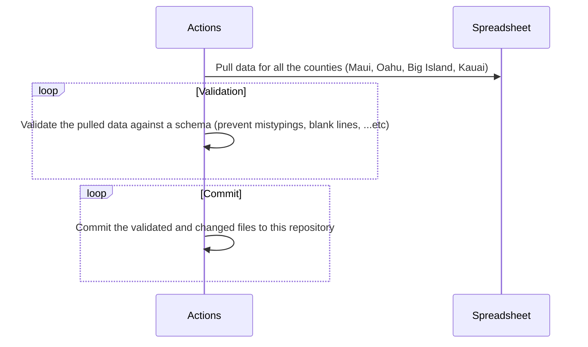
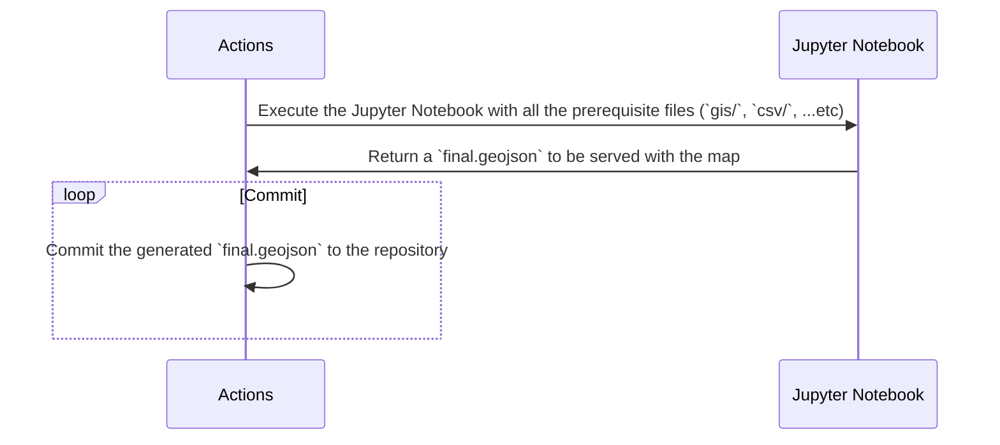

<h1 align="center">Hawaii Zoning Atlas</h1>

	:beach_umbrella: :volcano: :globe_with_meridians:

    
Interactive map showing how outdated zoning laws make it hard to build diverse, affordable housing in Hawaii

    <strong>Developed by Code with Aloha</strong>

  <h3>
  	<a href="https://hawaiizoningatlas.com">
      Website
    </a>
     | 
    <a href="https://github.com/CodeWithAloha/Hawaii-Zoning-Atlas/wiki">
      Wiki
    </a>
  </h3>

### Philosophy

This interactive map shows how outdated zoning laws make it hard to build diverse, affordable housing.

Zoning laws, adopted by thousands of local governments across the country, dictate much of what can be built in the United States.  We need to find better ways of helping people understand what zoning codes say, because they have a tremendous impact on our economy, on the environment, and on our society.  A zoning atlas that enables users to visualize the prevalence and nature of regulatory constraints, particularly on housing, can be an important tool to achieve that goal.

### Partners, Supporters, and Sponsors

- [National Zoning Atlas](https://www.zoningatlas.org/)
- [Mercatus Center](https://www.mercatus.org/)
- Faith Action Hawaii

### Resources

- [Measuring the Burden of Housing Regulation in Hawaii:](https://uhero.hawaii.edu/wp-content/uploads/2022/04/MeasuringTheBurdenOfHousingRegulationInHawaii.pdf) An April 2022 brief from UHERO, the economic research organization at the University of Hawaii, estimating that Hawaii has the most burdensome regulatory barriers of any state.
- [How Light Touch Density Can Address Hawaii’s Housing Shortage:](https://www.aei.org/research-products/report/how-light-touch-density-can-address-hawaiis-housing-shortage-examples-from-the-real-world/) Examples from the Real World: A report from the American Enterprise Institute applies lessons from other jurisdictions to Hawaii's unique context, proposing high-density transit-oriented development
- [Priced Out of Paradise:](https://hiappleseed.org/publications/priced-out-of-paradise/)  2018 report from Hawaii Appleseed addressing some of Hawaii's unique housing challenges: out of state ownership, investor speculation, and the proliferation of vacation rental units.
- [Introduction to Hawaii&#39;s Land Classification and Management System:](http://www.oha.org/wp-content/uploads/HRDC-LUTPManual_PRF6_FINAL.pdf) An official 76-page guide for residents written by state agencies and last updated in 2015.
- [Regulating Paradise:](https://scholarspace.manoa.hawaii.edu/bitstream/10125/24147/Callies%20-%20Regulating%20Paradise.pdf) A full-length 2010 book detailing key aspects of Hawaii land use law, including state and local planning, environmental regulations, and public lands.
- [ALOHA Homes: An Innovative Solution to Hawaii&#39;s Housing Shortage:](https://www.youtube.com/watch?v=8eTQLZYDUeM) State Sen. Stanley Chang, Chair of the Housing Commitee, has proposed numerous policy innovations aimed to address the housing crisis. ALOHA Homes is his flagship proposal for social housing.

### News Articles

- https://www.hawaiifreepress.com/Articles-Main/ID/39670/Hawaii-Zoning-Atlas-Reveals-where-and-how-Zoning-Rules-Limit-Housing-Supply-and-Increase-Costs
- (Around `~17:00`) https://www.hawaiipublicradio.org/podcast/the-conversation/2023-08-11/the-conversation-climate-change-and-natural-disasters-hawai%CA%BBi-zoning-atlas-helps-with-housing
- https://www.civilbeat.org/2022/06/this-group-is-trying-to-make-sense-of-hawaiis-regulatory-landscape/
- https://www.civilbeat.org/2022/09/a-tremendous-need-for-affordable-housing-in-hawaii-leads-to-long-waitlists/

### New Developers Start Here

The code can be seen live at [hawaiizoningatlas.com](https://hawaiizoningatlas.com)

The process of moving the data from the starting point (the datasheet) to the final destination (the website) involves a series of processes that we are hoping to automate.

#### Data Pipeline

The goal of the data pipeline is to help decrease the friction between getting data from the spreadsheet to the final form hosted by the website.

In the [HZA Research Guide](https://github.com/CodeWithAloha/Hawaii-Zoning-Atlas/wiki/Research-Guide) The user can find the starting point for the map which is the [datasheet](https://docs.google.com/spreadsheets/d/1YGt_Y70oy6qc09ZZ7kip9DM2JGtRC2fAHxi6JXOIsSk/edit#gid=0).

This datasheet is manually populated by people going through the various zoning laws (The links for the zoning laws are found in the repo's research guide.) and filling out cells according to the guidelines laid out in [How to Make a Zoning Atlas](https://www.zoningatlas.org/how).

After the data sheet is populated, it is then exported to a csv where the following steps need to occur:

* The county tabs are combined together
* Validation is run on the data
* The final csv is given the name `hawaii-zoning-data.csv`

The `hawaii-zoning-data.csv` file should then be placed into the data-pipeline folder.

In the data-pipeline folder there is a "gis" folder that holds the output of processing various shape files. These shape files come from the maps given in the [HZA Research Guide](https://github.com/CodeforHawaii/Hawaii-Zoning-Atlas/wiki/Research-Guide). The method of processing the shape files is outlined in [How to Make a Zoning Atlas](https://www.zoningatlas.org/how).

#### Data Processing

Once the data has been aggregated and in the correct form, it is processed by the CombineJurisdictions Jupyter Notebook. The notebook exports the final.geojson file that is placed in the repository's "data" directory. This is the data the populates the website.

#### Automation Goals

[GitHub actions](https://github.com/features/actions) is the tool we are using to automate the various parts of the data processing pipeline.

Different GitHub actions will perform the following tasks:

* Pull the data from the datasheet into a csv that combines the counties
* Run validation to ensure that the data is correct (prevent mistypings, blank lines, etc)
* Commit the validated and changed files to the repository

Once the data is ready for processing, another set of actions will perform the following tasks:

* Run the data through the `CombineJurisdiction` notebook
* Minimize the `final.geojson` file
* Commit the `final.geojson` file to the repository
  * The name of the `final.geojson` should include a timestamp and a reference to the original data used to generate it. This will allow us to rollback to different versions if needed.

